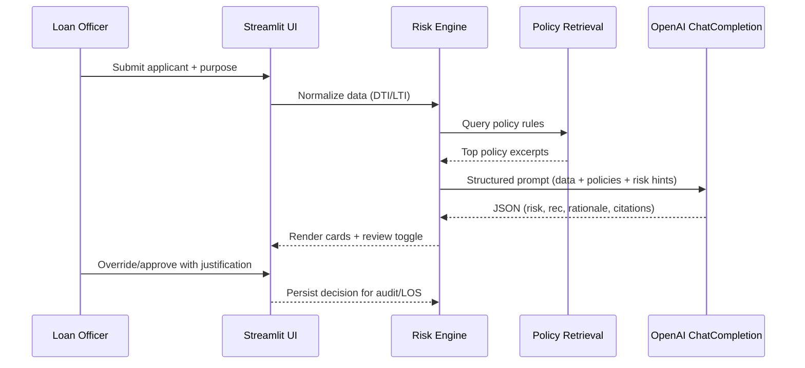

# Part 1 – Problem Analysis

## Typical loan risk assessment workflow
1. **Application submission** – Applicant provides demographics, income, liabilities, requested amount, loan purpose, and uploads supporting documents through an online form or branch intake.
2. **Document verification** – Operations staff validate identity documents, income proofs, and bank statements; inconsistencies trigger clarification requests.
3. **Credit bureau checks** – Pull credit score, trade-line history, delinquency flags, and fraud signals from external bureaus.
4. **Manual affordability and risk evaluation** – Underwriter calculates debt-to-income (DTI), loan-to-income (LTI), validates employment stability, and assesses purpose fit against product policies.
5. **Policy and exception handling** – Underwriter checks internal policy manuals for thresholds, allowable purposes, and conditions for overrides; escalates edge cases for supervisory approval.
6. **Final decision and notification** – Decision (approve/decline/refer) is recorded, pricing is set, and applicant is informed; audit trail is assembled for compliance.

## Pain points
- **Manual document reading** – Officers scan PDFs and statements, retyping figures and hunting for policy clauses.
- **Repetitive calculations and checks** – DTI/LTI, minimum score thresholds, and purpose eligibility are recomputed per case.
- **Inconsistent risk rationales** – Free-text memos vary by officer; policy citations are often missing.
- **Long turnaround time** – Hand-offs between intake, underwriting, and compliance cause delays.
- **Audit/compliance burden** – Evidence of policy alignment and exception documentation is often incomplete or dispersed across emails.

## Human judgment vs. inefficiency vs. delays
- **Human judgment required** – Evaluating nuanced employment stability, assessing unusual purposes, approving exceptions, and balancing compensating factors.
- **Repetitive manual work** – Data normalization, ratio calculations, extracting numbers from documents, and searching policy PDFs.
- **Delays and handoffs** – Waiting for document clarification, routing edge cases to supervisors, and assembling audit-ready memos.

# Part 2 – GenAI Solution Design & Justification

## Proposed capability
A **GenAI-powered loan risk assistant** supports (not replaces) underwriters by:
- Drafting affordability assessments with DTI/LTI and credit considerations.
- Retrieving and citing relevant policy clauses via local Retrieval-Augmented Generation (RAG).
- Generating consistent rationales, follow-up questions, and exception checklists.
- Flagging when human review is required while preserving officer override authority.

## Workflow improvements
- **Document/policy lookup** – Automated retrieval of policy clauses for eligibility, thresholds, and exceptions.
- **Risk narrative drafting** – LLM produces rationale, highlights risks, and proposes follow-ups to speed underwriting.
- **Exception support** – Explicitly lists mitigants and requires human confirmation for overrides.
- **Audit logging** – Structured outputs (citations, questions, rationales) ready for downstream LOS or audit systems.

## Why GenAI (vs. rules or OCR + deterministic scoring)
- **Beyond rules** – Rules capture thresholds but miss nuanced interactions (e.g., high DTI but stable tenure + collateral). LLM can reason over multiple factors and propose mitigants.
- **Beyond OCR** – OCR extracts numbers but does not explain decisions or cite policies. GenAI adds contextual narratives and policy awareness.
- **Adaptability** – Language models can incorporate new policy text without redeploying rules; RAG localizes responses without retraining.

## Conceptual architecture
- **Streamlit UI** – Intake form, policy previews, AI output cards, human-review toggle.
- **API / Orchestration** – Python services normalize data, call RAG, and invoke the LLM.
- **OpenAI LLM** – Structured ChatCompletion prompt produces JSON for the UI.
- **RAG (policy knowledge base)** – TF-IDF retrieval over `data/policy_rules.md` to ground model responses.
- **Audit logging & human-in-the-loop** – Structured output supports LOS ingestion; officer controls override recommendations.

```mermaid
graph TD
    A[Streamlit UI] -->|form data| B[Risk Engine]
    B --> C[Policy RAG]
    C -->|policy snippets| B
    B --> D[OpenAI LLM (Chat Completions)]
    D -->|JSON rationale| B
    B -->|structured result| A
    A -->|officer override + notes| E[Audit / LOS Integration]
```

## Sequence of a single assessment


## Real-world concerns and mitigations
- **PII handling and masking** – Avoid sending full IDs; truncate or hash identifiers in prompts; use secure transport and minimal retention.
- **Compliance and explainability** – Include policy IDs in responses; surface deterministic ratios alongside AI rationale.
- **Model transparency** – Response schema forces rationale, risk factors, and confidence; officers can override.
- **Integration with LOS** – Structured JSON output can be posted to existing LOS/audit APIs; policy citations aid downstream checks.
- **Human override and escalation** – UI provides “Human review required” toggle; exception paths require documented reasons.

## KPIs
- Decision turnaround time (median minutes per file).
- Underwriter effort reduction (minutes saved drafting memos).
- Rationale consistency (policy citations per decision, variance in wording).
- Audit readiness (percentage of cases with complete citations and follow-ups).
- Exception handling quality (approved exceptions with documented mitigants).

## Risks and mitigations
- **Hallucination** – Ground prompts with retrieved policy text; require citations; fall back to heuristics if LLM fails.
- **Bias** – Strip protected attributes; monitor output for disparate language; add fairness checks to downstream LOS.
- **Prompt injection** – Restrict user-provided text to data fields; sanitize inputs; avoid executing model-suggested code/URLs.
- **Over-reliance** – UI labels AI as advisory; mandatory human confirmation for exceptions.

# Part 3 – Prototype Demonstration (Streamlit)

## What the prototype does
- Accepts loan application input via Streamlit form.
- Normalizes data (DTI/LTI), retrieves policy snippets from `data/policy_rules.md`, and calls OpenAI ChatCompletion for a structured assessment.
- Returns **risk level**, **recommendation**, **rationale**, **policy citations**, **follow-up questions**, **missing documents**, optional **confidence**, and **human review** flag.
- Demonstrates GenAI value through contextual reasoning, narrative explanations, and policy-aware decision support.

## Assumptions
- OPENAI_API_KEY is available in the environment.
- Policy rules are captured in `data/policy_rules.md`; additional policies can be appended without code changes.
- Streamlit runs in a trusted internal environment with TLS termination handled by the host.

## File map (modular architecture)
- `app.py` – Streamlit UI and UX flow.
- `services/rag.py` – Local TF-IDF retrieval over policy markdown.
- `services/llm.py` – OpenAI ChatCompletion wrapper with structured prompt.
- `services/risk_engine.py` – Normalization, heuristic hints, and orchestration.
- `data/policy_rules.md` – Knowledge base for RAG grounding.
- `requirements.txt` / `.env.example` – Dependencies and configuration template.

## Sample test inputs
1. **Applicant A** – Salaried, income 8,000, liabilities 2,400, credit score 690, loan 40,000 for debt consolidation, documents: ID + bank statements.
2. **Applicant B** – Self-employed, income 5,000, liabilities 3,000, credit score 610, loan 80,000 for business expansion, documents: ID only.

## Sample outputs (illustrative)
- **Applicant A**: Risk **Medium**, Recommendation **Refer**, Rationale cites DTI 0.30 and near-prime score; cites “Income & Debt-to-Income” and “Credit Score Thresholds”; follow-ups request employment letter; human review **False**.
- **Applicant B**: Risk **High**, Recommendation **Decline/Refer**, Rationale cites DTI 0.60 and score <640; cites “Policy Exceptions” with mitigant requirements; follow-ups request tax returns and business ownership proof; human review **True**.

## How to run and test
1. Install dependencies: `pip install -r requirements.txt`.
2. Create `.env` from `.env.example` and set `OPENAI_API_KEY`.
3. Launch UI: `streamlit run app.py`.
4. Enter sample inputs above; observe policy snippets, AI rationale, citations, follow-ups, and human-review toggle.
5. Run automated tests: `pytest`.

## Bonus features included
- Confidence score and highlighted risk factors surfaced in the UI.
- Manual “Human review required” toggle to enforce underwriter oversight.
