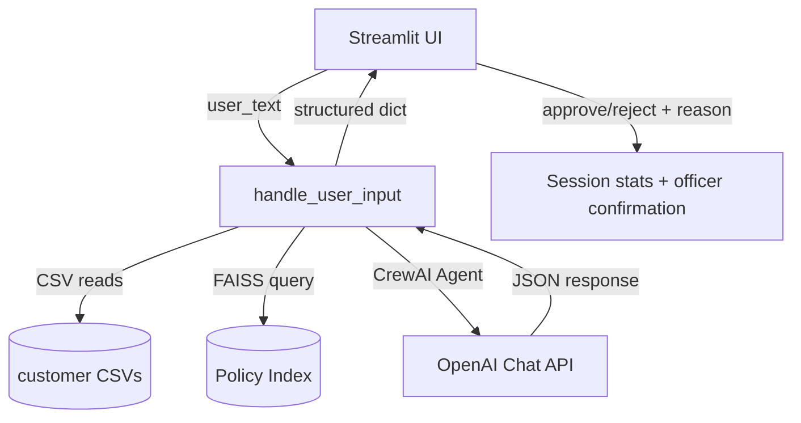

# Loan Assistant – Design Overview

## 1. Purpose
Provide loan officers with a guarded assistant that can clarify policies and draft loan assessments while ensuring a human owns the final decision. The UX must feel modern, capture audit notes, and strictly enforce policy evidence for every automated recommendation.

## 2. Solution Snapshot

- **Interaction layer**: Streamlit provides cards, memo expander, sidebar metrics, and officer decision controls.
- **Intelligence layer**: A single CrewAI agent uses `CustomerDataLookup` and `PolicyRetriever` tools to ground all statements.
- **Evidence requirements**: Non-Singaporeans must surface PR status; every loan recommendation must cite risk and interest-rate guidance pulled from policy PDFs.

## 3. Functional Blocks
1. **User Input & Validation**
   - Textarea captures loan questions or application requests.
   - Empty inputs are rejected immediately.
2. **Data Access**
   - `load_customer_data` stitches together the necessary CSV rows without merging tables.
   - Errors (missing credit, PR status, etc.) short-circuit the flow.
3. **Policy Retrieval (RAG)**
   - PDFs in `/policies` → `PyPDFLoader` → chunked via `RecursiveCharacterTextSplitter` → embedded with `SentenceTransformerEmbeddings` → FAISS index.
   - Cached in-memory for session reuse.
4. **Unified LLM Pipeline**
   - Prompt defined in `prompts/unified_agent.md` enforces JSON schema and compliance rules.
   - `run_unified_pipeline` orchestrates CrewAI and normalizes outputs, rejecting responses without policy evidence.
5. **UI Rendering**
   - Customer and assessment cards highlight key facts.
   - Memo expander wraps the AI letter in a dashed box.
   - Officer dashboard (sidebar + decision form) records final approvals/rejections and justification text.

## 4. Data Sources
| File | Columns (post redaction) | Purpose |
|------|--------------------------|---------|
| `data/credit_scores.csv` | `ID`, `CreditScore` | Provides latest credit score |
| `data/account_status.csv` | `ID`, `Name`, `Nationality`, `Email`, `AccountStatus` | Establishes identity + account standing |
| `data/pr_status.csv` | `ID`, `Name`, `PRStatus` | Confirms residency status for non-Singaporeans |
| `policies/*.pdf` | N/A | Authoritative loan policy text |

## 5. UX States
- **Q&A**: Single accent card with short answer; no officer controls.
- **Loan Evaluation**: Dual cards, policy evidence text block, memo expander, and officer decision panel.
- **Error**: Streamlit `st.error` call with descriptive message; pending application state cleared.

## 6. Compliance Controls
1. All loan assessments must include:
   - Risk tier derived from policy text.
   - Interest rate guidance + justification snippet.
   - Policy notes referencing the retrieved passages.
2. Officer approvals require:
   - Explicit radio selection.
   - Free-text justification captured before recording.
3. Session stats provide a quick audit snapshot (counts + approval rate).

## 7. Extension Points
- Swap FAISS for managed vector DB (Pinecone, Weaviate) without changing the tool signature.
- Persist officer decisions to a database/API for audit trails.
- Add authentication in Streamlit (e.g., SSO) before exposing beyond development.
