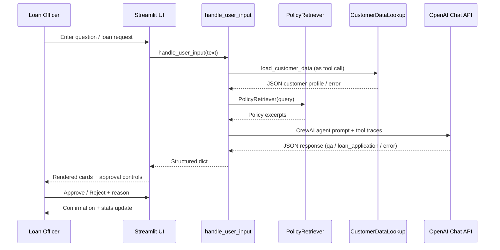
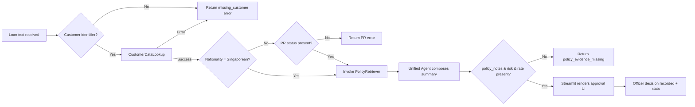

# Operational Workflows

## 1. User Interaction Flow

## 2. Loan Application Decision Flow

## 3. Streamlit Session State
| Key | Description | Initialization |
|-----|-------------|----------------|
| `pending_application` | Cached AI evaluation awaiting officer action | `None` until loan response | 
| `officer_decision` | Radio selection (`Approve` / `Reject`) | Pre-populated with AI suggestion |
| `officer_reason` | Free-text justification | Blank for each new evaluation |
| `decision_stats` | Dict with aggregated approvals/rejections | `{approved: 0, rejected: 0}` |

## 4. Officer Approval Checklist
1. Review **Customer Snapshot** card.
2. Review **AI Assessment** card with risk, rate, policy evidence.
3. Expand **AI Draft Letter** if more context is needed.
4. Select `Approve` or `Reject` in the decision radio buttons.
5. Provide a justification in the textarea (required for compliance).
6. Click **Record Final Decision** to log outcome and reset UI.

## 5. Error Handling Signals
| Error Code | Trigger | Surface |
|------------|---------|---------|
| `empty_input` | User submits blank text | Streamlit warning |
| `policy_unavailable` | FAISS index failure or missing PDFs | Streamlit error |
| `llm_output_parse_error` | Agent returns malformed JSON | Streamlit error |
| `policy_evidence_missing` | LLM omitted policy-based risk/interest | Streamlit error prompting re-run |

